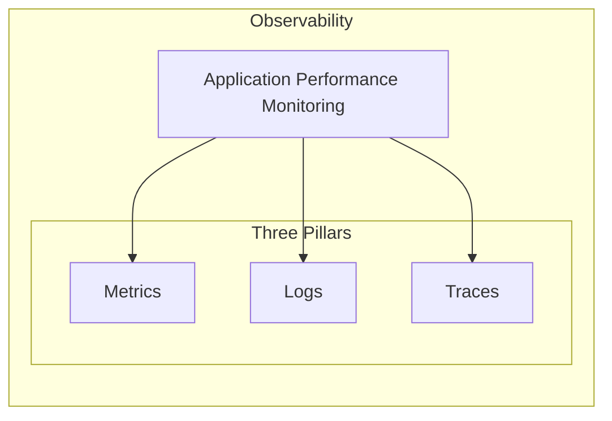

# Phase 1: Foundations - Introduction to Observability & Monitoring

## What is Observability?

### Technical Definition
Observability is a measure of how well internal states of a system can be inferred from knowledge of its external outputs. In the context of software and systems, it means you can understand what's happening inside your system just by observing its outputs, without having to ship new code to do so. It relies on three main pillars of data: **metrics, logs, and traces**.

### Simple Definition
Imagine your car's dashboard. It tells you your speed, fuel level, and engine temperature. That's **monitoring**. Now, imagine you could ask your car *why* the engine temperature is high, and it could tell you it's because the coolant is low, the fan is broken, or you're driving up a steep hill on a hot day. That's **observability**. It's about being able to ask any question about your system and get an answer.

### Real-time Example
A user reports that your e-commerce website is slow. With an observable system, you can look at the traces for that user's session and see that a specific microservice is taking a long time to respond. You can then drill down into the logs for that microservice and see that it's getting a lot of errors from a database. Finally, you can look at the metrics for that database and see that its CPU is maxed out. You've just used observability to find the root cause of the problem.

## Difference between Monitoring, Logging, Tracing, and APM

These terms are often used interchangeably, but they have distinct meanings.

| Term | Technical Definition | Simple Definition | Real-time Example |
|---|---|---|---|
| **Monitoring** | The process of collecting, processing, and displaying real-time quantitative data about a system, such as query-per-second or server uptime. | Watching your system's health and performance over time. It's like a doctor checking your vital signs. | A dashboard shows that CPU usage on your web server has been at 95% for the last hour. |
| **Logging** | The process of recording discrete events that happen within a system. Logs are timestamped, immutable records of events. | A detailed diary of everything that happens in your system. | A log entry shows that a user tried to log in with the wrong password at a specific time. |
| **Tracing** | The process of tracking a single request as it travels through all the different services in a distributed system. | Following a single user's journey through your entire system. | A trace shows that a user's request to your website was slow because it had to wait for a response from a third-party API. |
| **APM (Application Performance Monitoring)** | A set of tools and practices used to monitor and manage the performance, availability, and user experience of software applications. | A specialized type of monitoring that focuses specifically on how well your applications are running. | An APM tool alerts you that the average response time for your checkout service has increased by 50% in the last hour. |

### Diagram: The Relationship Between these Concepts

## Why Organizations Use Dynatrace

Dynatrace is a platform that provides all of the above in a single, integrated solution. Here's why organizations choose it:

*   **All-in-one Platform:** Dynatrace combines observability, APM, infrastructure monitoring, security, and business analytics in one place. This eliminates the need to use multiple, disparate tools.
*   **Automation:** Dynatrace's AI engine, Davis, automates many of the manual tasks associated with monitoring and observability. It can automatically detect anomalies, identify root causes, and even suggest remediation steps.
*   **Scalability:** Dynatrace is designed to handle the complexity and scale of modern, cloud-native environments. It can monitor everything from monolithic applications to microservices running in containers.
*   **Ease of Use:** Dynatrace is designed to be easy to use, even for non-experts. Its Smartscape technology automatically discovers and maps all the components of your application and infrastructure, giving you a real-time view of your entire environment.
*   **Business Context:** Dynatrace can connect application performance to business outcomes. For example, it can show you how a slow-loading page is impacting your conversion rates.

By providing a single source of truth for all performance-related data, Dynatrace helps organizations to:

*   Improve application performance and availability
*   Reduce the time it takes to resolve problems
*   Innovate faster by giving developers the feedback they need to write better code
*   Make better business decisions by understanding the impact of application performance on the bottom line.