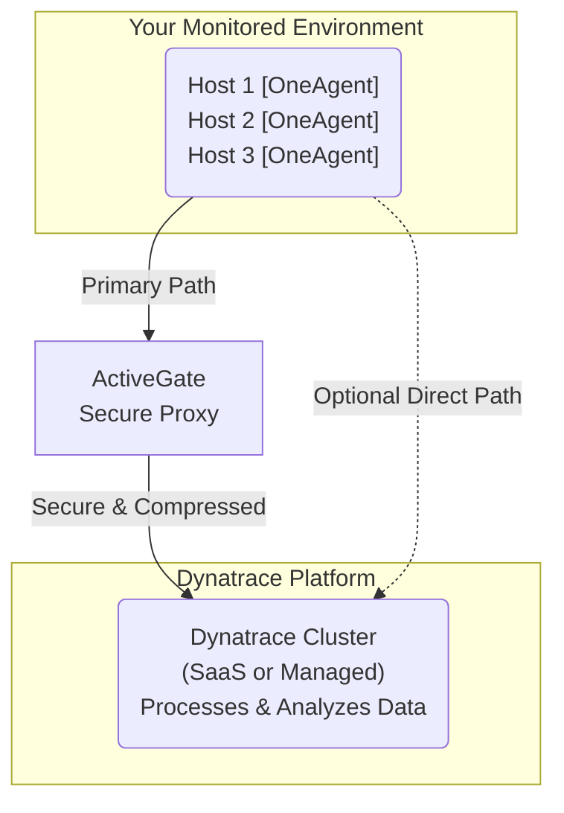

# Phase 1: Foundations - Dynatrace Overview

## Dynatrace Architecture

### Technical Definition
Dynatrace's architecture is built around a few core components that work together to provide full-stack observability. The primary components are the **OneAgent**, which collects data from monitored hosts, the **ActiveGate**, which acts as a secure proxy, and the **Dynatrace Cluster** (available as SaaS or Managed), which processes, analyzes, and stores the data.

### Simple Definition
Think of Dynatrace like a team of detectives solving a mystery in your IT environment.
*   **OneAgent** is the detective on the scene, gathering clues (data) from everywhere.
*   **ActiveGate** is the secure courier who takes the clues back to the lab, sometimes from hard-to-reach places.
*   **Dynatrace Cluster** is the high-tech lab where all the clues are analyzed, connected, and where the AI "master detective" (Davis) solves the case.

### Diagram: Dynatrace Architecture

## Core Components

| Component | Technical Definition | Simple Definition | Real-time Example |
|---|---|---|---|
| **OneAgent** | A single, lightweight binary installed on each monitored host. It uses code injection and deep process monitoring to automatically discover and collect high-fidelity data on infrastructure, applications, services, and users. | A "do-it-all" sensor you install once on your servers. It automatically figures out what's running and starts collecting detailed performance data without any manual configuration. | You install OneAgent on a server running a Java application. It automatically detects the JVM, injects itself, and starts tracing every transaction, collecting CPU, memory, and network metrics for the process. |
| **ActiveGate** | A secure proxy that consolidates and compresses data from OneAgents before sending it to the Dynatrace Cluster. It can also be used for monitoring cloud platforms, running synthetic monitors, and monitoring remote technologies. | A secure gateway that helps OneAgents talk to the main Dynatrace system, especially in complex networks. It also takes on special monitoring jobs, like checking your website from different locations. | In a company with a strict firewall, OneAgents can't reach the internet. They send their data to an ActiveGate inside the network, and only the ActiveGate is allowed to connect to the Dynatrace SaaS cluster. |
| **Smartscape** | A real-time, interactive visualization of your entire application topology. It maps all dependencies between applications, services, processes, and hosts, showing how everything is connected. | A live, interactive map of your entire IT world. It shows you how all your apps and servers are connected and talking to each other. | You click on your e-commerce application in Smartscape and instantly see it depends on three microservices, which run on two different servers and connect to a specific database. |
| **Davis AI** | The causal AI engine at the core of Dynatrace. It analyzes billions of dependencies in real-time to automatically detect anomalies, identify the precise root cause of problems, and assess their business impact. | The "brain" of Dynatrace. It constantly analyzes all the data, finds problems automatically, and tells you exactly what's wrong, so you don't have to search for it yourself. | Your website becomes slow. Davis AI automatically opens a problem ticket, tells you the root cause is a database slowdown, and shows you the exact database query that is causing the issue. |
| **Metrics, Traces, Logs** | The three pillars of observability data that Dynatrace collects and unifies. **Metrics** are numerical measurements, **Traces** follow a request's path, and **Logs** are event records. | The raw data Dynatrace uses. Metrics are the numbers (like CPU usage), Traces are the journey of a user request, and Logs are the diary of events. | Davis AI uses a high CPU **metric** on a host to correlate with a slow **trace** for a user, and then points to an error message in the **logs** to pinpoint the root cause. |

## Deployment Models: SaaS vs. Managed

This is a critical choice when starting with Dynatrace.

| Feature | Dynatrace SaaS | Dynatrace Managed |
|---|---|---|
| **Hosting** | Hosted and managed by Dynatrace in the cloud (AWS, Azure, GCP). | You host and manage the Dynatrace cluster in your own data center or private cloud. |
| **Maintenance** | Dynatrace handles all updates, backups, and maintenance. | Your team is responsible for installing, updating, and maintaining the cluster. |
| **Data Storage** | Your data is stored in the Dynatrace cloud. | Your data stays within your own network, which can be a requirement for strict data sovereignty regulations. |
| **Setup** | Very fast and easy to set up. Just create an account and start installing OneAgents. | More complex setup, as you need to provision and configure the servers for the cluster. |
| **Best For** | Most organizations, especially those with a cloud-first strategy who want to offload management overhead. | Organizations with strict data residency requirements, or those who want complete control over their monitoring environment. |

### Simple Analogy
*   **SaaS:** Like renting an apartment. The landlord (Dynatrace) takes care of all the maintenance and infrastructure. You just move in and use it.
*   **Managed:** Like owning a house. You have full control, but you are also responsible for all the upkeep, from fixing the roof to mowing the lawn.