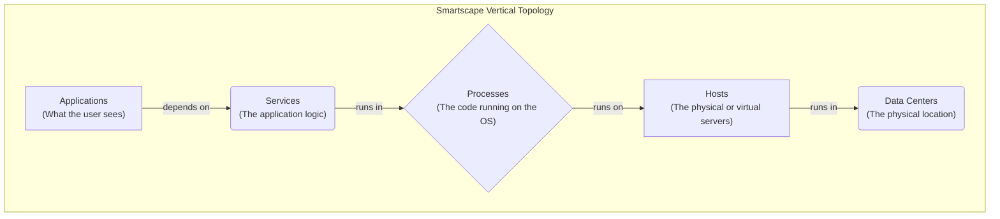

# Phase 2: Core Monitoring - Deep Dive: Smartscape & Topology

## Introduction
Smartscape is one of Dynatrace's most powerful and visually impressive features. It's the engine that transforms raw data into a meaningful, understandable map of your entire IT environment. Understanding how to read and use Smartscape is key to unlocking the full potential of Dynatrace.

## Smartscape: The Interactive Map of Your Environment

*   **Technical Definition:** Smartscape is a near real-time, fully automated, and interactive visualization of your complete application topology. It maps all discovered components and their transactional dependencies, both vertically (across stack tiers, e.g., a host running a process) and horizontally (within a tier, e.g., a service calling another service). This map is continuously updated by the OneAgent and the Davis AI engine.
*   **Simple Definition:** Smartscape is the "Google Maps" for your application. It automatically draws a map that shows how everything is connected: which applications your users access, which services those applications use, which processes run those services, and which servers host those processes. You can click around, zoom in, and see how everything works together.
*   **Real-time Example:** An operations engineer wants to understand the full impact of a planned database server maintenance. They open Smartscape, find the database server, and click on it. Smartscape instantly highlights all the dependencies: it shows the specific database processes running on that server, all the application services that connect to those database processes, and all the user-facing web applications that rely on those services. The engineer now has a complete list of impacted applications and can notify the correct teams.

### Diagram: The Layers of Smartscape
Smartscape visualizes your environment in distinct, interconnected layers.

## Understanding Relationships and Dependencies

Smartscape's power lies in its ability to show relationships instantly. When you select any component (a "node") in the map:
*   **Vertical Dependencies:** You can see the full stack it belongs to. Select a `process`, and you'll see the `host` it runs on and the `service` it provides.
*   **Horizontal Dependencies:** You can see all its transactional relationships. Select a `service`, and Smartscape will draw lines to all the other services it calls and all the services that call it.

This makes it incredibly easy to answer questions like:
*   "If this host goes down, what applications will be affected?"
*   "Which services does my mobile app actually talk to?"
*   "Is this slow service impacting any other parts of the system?"

## Service Flow: Visualizing Transaction Paths

*   **Technical Definition:** The Service Flow is a dynamic, transaction-centric view that illustrates the real-time sequence of service calls for a specific transaction or user action. It's a more detailed, "flowchart" style visualization of the data presented in Smartscape, showing the path, timing, and health of a single business transaction as it moves through the distributed environment.
*   **Simple Definition:** If Smartscape is the map of your city, the Service Flow is the turn-by-turn GPS navigation for a single car's journey. It shows you the exact path a user's request took, which "streets" (services) it traveled on, and how long it spent at each "intersection."
*   **Real-time Example:** A user complains that their order confirmation page is taking forever to load. A support engineer finds the user's session in Dynatrace and opens the "Service Flow" for that specific page load. The flow diagram immediately shows the path:
    1.  Browser -> Web Server (50ms)
    2.  Web Server -> Order Service (25ms)
    3.  Order Service -> **Inventory Service (4,500ms)** -> (timeout)
    4.  Order Service -> Shipping API (30ms)
    The diagram visually pinpoints that the call to the `Inventory Service` is the bottleneck, taking 4.5 seconds. This allows the team to focus their investigation on that specific service immediately.

## Real-Time Visualization

Both Smartscape and Service Flow are not static diagrams. They are living, breathing representations of your environment.
*   When you deploy a new microservice, it automatically appears in Smartscape within minutes.
*   If a network connection between two services breaks, the line connecting them in Smartrace will turn red.
*   When you scale up your application by adding more hosts, they automatically appear in the map.

This real-time nature eliminates the need for manual documentation or architecture diagrams, which are almost always out of date. With Dynatrace, you always have an accurate, up-to-the-minute view of your complex system.