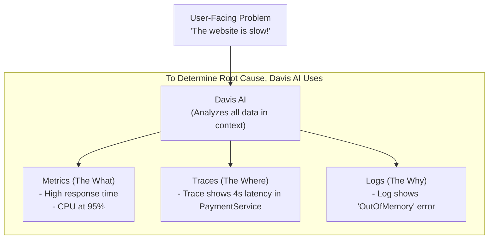

# Phase 3: Data & AI - Metrics, Logs, and Traces (MLT)

## Introduction
Metrics, Logs, and Traces are often called the "three pillars of observability." They are the raw data types that, when collected and analyzed together, provide a complete picture of a system's health and behavior. Dynatrace was built from the ground up to automatically collect, unify, and analyze these three data streams in context.

### Diagram: The Three Pillars of Observability in Dynatrace

## 1. Metrics and Custom Metrics Ingestion

*   **Technical Definition:** A metric is a numerical representation of a measure of a system's health or performance over time. It consists of a timestamp, a name (e.g., `cpu.usage`), a value, and key-value pairs called dimensions (e.g., `host=server1`, `region=us-east-1`). Dynatrace automatically collects thousands of metrics from your infrastructure and applications.
*   **Simple Definition:** Metrics are the numbers you track. Think of the speedometer, fuel gauge, and temperature gauge on your car's dashboard—those are all metrics. They tell you *what* is happening.
*   **Real-time Example:** A standard metric in Dynatrace is `host.cpu.usage`. Dynatrace collects this metric every few seconds for every monitored host, allowing you to see trends, set alerts for high usage, and compare CPU usage across different servers.

### Custom Metrics Ingestion
*   **Technical Definition:** Dynatrace allows you to ingest custom metrics beyond what OneAgent collects automatically. This can be done via various methods, including the Dynatrace Metrics API, StatsD, or by creating custom OneAgent extensions. These metrics can represent business KPIs, application-specific values, or data from technologies not supported out-of-the-box.
*   **Simple Definition:** Sometimes you want to track numbers that are specific to your business, not just technical ones. Custom metrics let you send these numbers to Dynatrace so you can see them alongside all the technical data.
*   **Practical Example:** An e-commerce company wants to track the number of items added to shopping carts in real-time. Their application code can send a custom metric called `business.events.addToCart` to the Dynatrace API every time this action occurs. They can then build a dashboard to visualize this metric, correlate it with site performance, and get alerted if the rate of "add to carts" suddenly drops, which could indicate a business problem.

## 2. Log Monitoring (Centralized Log Analytics)

*   **Technical Definition:** A log is an immutable, timestamped record of a discrete event that occurred within a system. Dynatrace's log monitoring capabilities, powered by its Grail data lakehouse, centralize logs from all sources. OneAgent can automatically collect logs from hosts and containers, or you can forward logs from other sources. All logs are indexed and searchable via the Dynatrace Query Language (DQL).
*   **Simple Definition:** Logs are the detailed, line-by-line diary of your application. They record everything that happens, from a user logging in to a critical error occurring. They tell you *why* something happened.
*   **Real-time Example:** A user reports an error when trying to upload a file. The developer doesn't see a crash, but the feature isn't working. They go to the Log Viewer in Dynatrace and search for logs from that user's time frame containing the word "error" or "failed". They find a log entry: `WARN: File upload failed for user 'jane.doe'. Reason: File size 25MB exceeds limit of 20MB.` The log provides the exact, detailed reason for the failure instantly.

## 3. Distributed Tracing Basics

*   **Technical Definition:** A distributed trace represents the end-to-end journey of a single request as it propagates through multiple services in a distributed system. Each trace is composed of "spans," where each span represents a single unit of work (e.g., an HTTP call, a database query). Dynatrace's patented **PurePath® technology** is its implementation of distributed tracing, which automatically captures and stitches together these spans.
*   **Simple Definition:** Traces are the "GPS" for a user's request. They follow a single action—like clicking "Buy Now"—as it travels through all the different microservices in your backend, showing you the exact path it took and how long it spent at each stop. They tell you *where* a problem is.
*   **Real-time Example:** A user clicks a button to view their order history, and it takes 8 seconds. The metrics show a slow response time, but not where the slowness is. The developer looks at the PurePath (the trace) for that user's click. They see the request went from the browser to the web server, then to the `AccountService`, which then called the `OrderDB`. The trace clearly shows that the database query inside the `OrderDB` call took 7.8 of the total 8 seconds. The trace has pinpointed the exact location of the bottleneck.