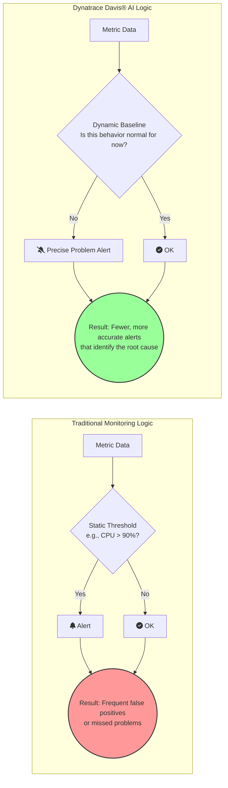

# Phase 3: Data & AI - Davis AI Engine

## Introduction
Davis is the causal AI engine at the heart of the Dynatrace platform. It's what elevates Dynatrace from a data collection tool to a true software intelligence platform. Davis automates anomaly detection, eliminates alert noise, and provides precise root cause analysis, saving teams countless hours of manual troubleshooting.

## 1. How AI Detects Anomalies Automatically

*   **Technical Definition:** Davis uses sophisticated machine learning algorithms to perform **automatic, multi-dimensional baselining** for every metric and application in your environment. It continuously learns the "normal" operational behavior, considering factors like time of day, day of week, and user traffic patterns. An anomaly is detected when there is a statistically significant deviation from this dynamic, auto-generated baseline.
*   **Simple Definition:** Davis constantly watches your system and learns its normal rhythms. It knows that your website is busy on Monday mornings and quiet on Saturday nights. Instead of using dumb, static thresholds (like "alert if CPU is over 90%"), Davis knows that 95% CPU might be normal during a flash sale but highly abnormal at 3 AM. It only alerts you when something is *truly unusual* for the current situation.
*   **Real-time Example:** A retail website's CPU usage normally peaks at 80% during the lunch hour rush. A static threshold set at 85% would never fire. One Tuesday, a bad code deployment causes CPU to hit 80% at 10 AM, when it's normally at 40%. A static threshold wouldn't notice, but Davis immediately detects this as a major deviation from the learned baseline for a Tuesday morning and flags it as an anomaly, allowing the team to fix the issue before the lunch rush even begins.

### Diagram: Static Thresholds vs. Davis AI Baselining

## 2. Root Cause Analysis (RCA)

*   **Technical Definition:** When a problem is detected that impacts users or service levels, Davis performs a **causal fault-tree analysis**. It leverages the real-time dependency information from Smartscape to analyze the sequence of events across all related components (applications, services, processes, hosts, logs). It looks for a single underlying event—such as a deployment, a configuration change, an infrastructure issue, or a resource saturation—that is the ultimate cause of all the symptoms. This is **causation**, not just correlation.
*   **Simple Definition:** Davis is the ultimate detective. When your website goes down, it doesn't just give you a list of 20 things that are broken (the symptoms). It analyzes all the clues, uses the Smartscape map to see how everything is connected, and gives you a single, definitive answer: "The root cause of the problem is the new code you deployed 15 minutes ago, which is causing a specific database query to fail."
*   **Real-time Example:** Users start getting "500 Internal Server Error" messages. A monitoring tool based on correlation might send alerts for: 1) High error rate, 2) Slow response time on the `checkout` service, 3) High CPU on `host-A`, 4) High memory on `host-A`. The team has to figure out how they're related. Davis, however, analyzes the fault-tree and produces a single problem card that says: **Root Cause:** A recent deployment of the `auth-service` introduced a memory leak. This caused the process to consume all available memory on `host-A`, which in turn slowed down the `checkout` service that also runs on that host, leading to the user-facing errors. The team knows exactly where to start fixing the problem.

## 3. Event Correlation

*   **Technical Definition:** Davis intelligently groups multiple, related anomaly events across different entities into a single, consolidated **Problem**. Instead of sending out a storm of individual alerts, Dynatrace creates one problem notification that evolves over time, adding new symptoms as they are discovered and providing a complete picture of the blast radius.
*   **Simple Definition:** Instead of flooding your chat channels and email with hundreds of alerts during a major outage (a phenomenon known as an "alert storm"), Davis bundles everything related into one neat package. You get a single notification that says, "There's a problem," and inside that notification, you can see the root cause and all the different parts of your system that are being affected.
*   **Real-time Example:** A network switch fails. A traditional monitoring system might send 50 separate alerts: "Host 1 is down," "Host 2 is down," "Service A is unavailable," "Service B is unavailable," and so on. This is overwhelming. Davis sees that all these hosts are in the same data center and all went offline at the same time. It correlates these events into a single Problem card titled "Multiple infrastructure components are offline in the US-East-1 data center," immediately pointing the team to a widespread infrastructure failure rather than an application-level issue. This dramatically reduces the mean time to resolution (MTTR).