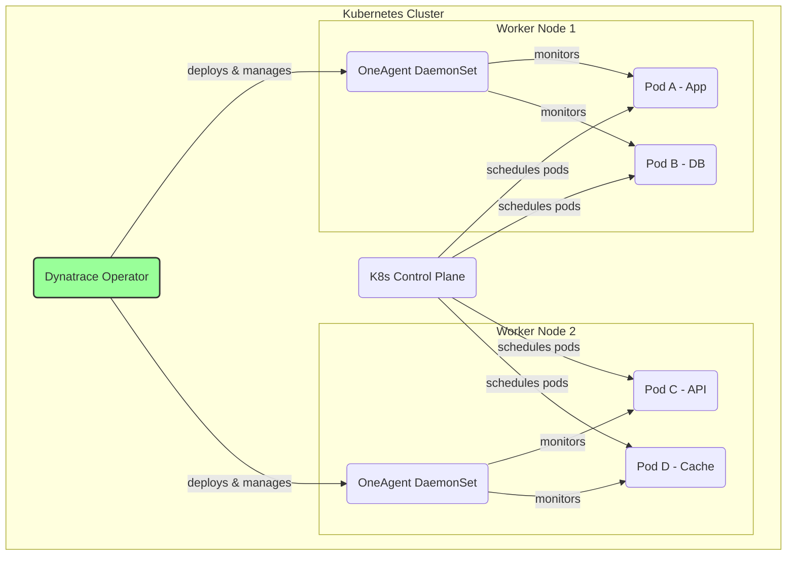

# Phase 4: Advanced Monitoring & Automation - Cloud-Native Monitoring

## Introduction
Cloud-native is an approach to building and running applications that fully leverages the advantages of the cloud computing model. It's characterized by technologies like containers, microservices, and serverless functions, running on dynamic, elastic infrastructure. Monitoring these environments requires a platform that is automated, scalable, and understands the ephemeral and interconnected nature of these technologies.

## 1. Kubernetes, OpenShift, EKS/AKS/GKE Integrations

*   **Technical Definition:** Dynatrace provides comprehensive, automated observability for any Kubernetes distribution, including self-managed clusters, OpenShift, and managed offerings like Amazon EKS, Azure AKS, and Google GKE. This is achieved by deploying the **Dynatrace Operator** to the cluster. The Operator manages the lifecycle of the OneAgent, rolling it out as a DaemonSet to all nodes. This provides full-stack visibility, from the infrastructure (node health) to the Kubernetes layer (pods, deployments, services) and deep into the code of the containerized applications themselves.
*   **Simple Definition:** Dynatrace speaks Kubernetes fluently. You install one thing (the Dynatrace Operator) in your cluster, and it automatically figures everything out. It gives you a perfect, real-time map and health status of your entire containerized world, including the servers they run on and the code inside them, no matter which cloud provider you use.
*   **Practical Example:** A platform engineering team runs their company's microservices on Amazon EKS. They deploy the Dynatrace Operator via a simple Helm chart. Dynatrace immediately discovers all their EKS nodes, the pods running on them, and the services they expose. When a pod starts crashing due to an "out of memory" error, Davis AI opens a single problem ticket. This ticket shows the pod's memory usage compared to its configured limit, provides the container logs directly in the UI, and identifies the exact Java code responsible for the memory leak, leading to a quick resolution.

### Diagram: Dynatrace in a Kubernetes Cluster

## 2. Cloud Foundry Monitoring

*   **Technical Definition:** Dynatrace integrates with Cloud Foundry (and its variants like Tanzu Application Service) via the **OneAgent buildpack**. This buildpack is included in an application's deployment manifest (`manifest.yml`). When an application is deployed using `cf push`, the buildpack automatically injects the OneAgent into the application's container (a Garden container running on a Diego cell), requiring no code changes. This provides full-stack monitoring, including PurePath tracing for the application, process-level visibility, and correlation with the underlying Cloud Foundry infrastructure.
*   **Simple Definition:** If you use Cloud Foundry to run your apps, you just add the "Dynatrace ingredient" to your application's recipe (`manifest.yml`). When you deploy your app, Dynatrace is automatically baked in, and it starts monitoring everything from your code down to the platform infrastructure it runs on.
*   **Practical Example:** A development team uses Cloud Foundry to host a Spring Boot application. They add the Dynatrace OneAgent buildpack to their `manifest.yml` file. When they `cf push` the application, the buildpack automatically downloads, configures, and launches the OneAgent alongside their app. The application and its services immediately appear in the Dynatrace UI, with full, code-level visibility. When a downstream service becomes slow, the Service Flow view in Dynatrace clearly shows the latency, allowing the team to identify the bottleneck without needing to access Cloud Foundry logs manually.

## 3. Serverless (AWS Lambda, Azure Functions)

*   **Technical Definition:** Dynatrace provides observability for serverless compute platforms like AWS Lambda and Azure Functions. For AWS Lambda, this is typically achieved by adding a **Dynatrace Lambda Layer** to the function's configuration. This layer contains the necessary components to trace the function's execution. It captures invocation details, execution time, memory usage, cold starts, and errors. Crucially, it continues the PurePath trace, stitching together calls from an API Gateway through the Lambda function to downstream services like DynamoDB or other APIs.
*   **Simple Definition:** Even for "serverless" code that only runs for a few seconds when triggered, Dynatrace can watch it. You add a Dynatrace "helper" (a Lambda Layer) to your function. This helper captures exactly what the function did, how long it took, whether it started "cold" (which adds delay), and if it had any errors. It connects the dots between the trigger and whatever services the function called.
*   **Practical Example:** A mobile app's backend uses an AWS Lambda function triggered by API Gateway to process user profile updates. Users report that saving their profile is sometimes slow. By adding the Dynatrace Lambda Layer, developers get full visibility in Dynatrace. They look at the traces and discover two things:
    1.  The slowest invocations are all associated with a "cold start," meaning the function had to be initialized from scratch.
    2.  Even in warm starts, the function spends 80% of its time waiting for a response from a third-party address validation API.
    Based on this data, they decide to increase the provisioned concurrency for the function to reduce cold starts and open a ticket with the third-party API provider to investigate the latency.