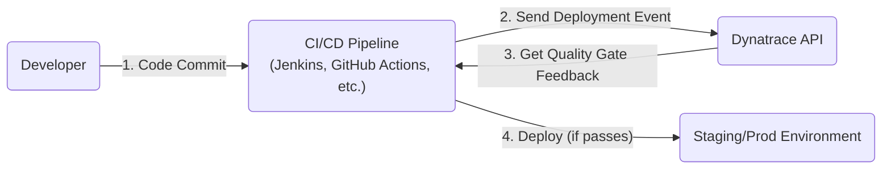

# Phase 4: Advanced Monitoring & Automation - Automation & DevOps

## Introduction
In modern DevOps practices, the goal is to increase deployment velocity without sacrificing quality or reliability. This is achieved by "shifting left"—integrating testing, monitoring, and feedback as early as possible into the software development lifecycle (SDLC). Dynatrace AutomationEngine and its integrations are designed to embed data-driven intelligence directly into your CI/CD pipelines and operational workflows.

## 1. Dynatrace & CI/CD Integration (Jenkins, GitHub Actions, Azure DevOps)

*   **Technical Definition:** Dynatrace integrates with virtually any CI/CD tool (including Jenkins, GitHub Actions, Azure DevOps, etc.) via a rich set of APIs and plugins. The core of this integration is the ability for the CI/CD pipeline to send contextual events to Dynatrace and, in turn, for Dynatrace to provide feedback to the pipeline. Key information like build numbers, Git commits, and deployment stages are sent to the Dynatrace Events API, which annotates all monitoring data with this context.
*   **Simple Definition:** This is about making your development pipeline and Dynatrace talk to each other. The pipeline tells Dynatrace, "Hey, I'm deploying version 1.2.3 right now." Dynatrace then stamps "v1.2.3" on all the performance data it collects. If a problem starts, everyone can see it happened right after v1.2.3 was deployed, instantly pointing to the cause.
*   **Practical Example:** A developer merges a pull request, which triggers a GitHub Actions workflow to build and deploy a new container to a staging environment. A step in the workflow uses the Dynatrace CLI or a `curl` command to send a custom deployment event to the Dynatrace API. The event includes the Git commit hash and the pull request number. Later, when a performance issue is detected in staging, the Dynatrace problem card automatically shows this deployment event as the root cause, with a direct link back to the exact code change in GitHub.

### Diagram: CI/CD Integration Flow

## 2. Quality Gates with Dynatrace in Pipelines

*   **Technical Definition:** A quality gate is an automated, data-driven checkpoint within a CI/CD pipeline. It uses Dynatrace data to verify if a new build meets predefined quality criteria before it can be promoted to the next stage or to production. This is often implemented using **Dynatrace Site Reliability Guardian (SRG)**, which evaluates a set of Service-Level Objectives (SLOs) for a given timeframe. If the build's performance (e.g., response time, failure rate) violates an SLO, the guardian fails, which in turn fails the pipeline, automatically stopping a bad release.
*   **Simple Definition:** A quality gate is an automatic "go/no-go" decision. After a deployment, the pipeline asks Dynatrace, "Based on the last 10 minutes of performance data, is this new version good enough?" Dynatrace checks its SLO report card and gives a thumbs-up or thumbs-down. A thumbs-down automatically stops the deployment, preventing a bad update from reaching your users.
*   **Practical Example:** An Azure DevOps release pipeline deploys a new service version to a performance testing environment and runs a 15-minute load test. After the test, a "Dynatrace Quality Gate" task is executed. This task checks an SLO defined in Dynatrace: "99.5% of login requests must be faster than 500ms." During the test, the new version had a login response time of 650ms. The SLO was not met, so the quality gate returns a "fail" status. The Azure DevOps pipeline immediately stops, marks the release as failed, and posts an alert to the team's Microsoft Teams channel, preventing the faulty code from ever reaching production.

## 3. Auto-remediation Workflows

*   **Technical Definition:** Auto-remediation is the process of automatically triggering corrective actions in response to problems detected by Davis AI. This is orchestrated by the **Dynatrace AutomationEngine**, which allows you to build event-driven workflows. A workflow can be triggered by a Dynatrace problem and can perform a sequence of actions, such as sending notifications to Slack, creating a Jira ticket, executing an Ansible playbook to restart a service, or calling a cloud provider's API to scale up resources.
*   **Simple Definition:** This gives Dynatrace the power to not just *find* problems, but to *fix* them automatically. If Davis detects that a server has run out of disk space, it can trigger a workflow that automatically runs a cleanup script—all without waking up a human engineer.
*   **Practical Example:** Davis AI detects a problem where a critical service is responding with a high rate of 503 errors. This problem triggers a Dynatrace workflow:
    1.  **Step 1 (Notify):** The workflow immediately sends a message to the on-call SRE's Slack channel with the problem details and a link to the Dynatrace problem card.
    2.  **Step 2 (Analyze):** It queries the service's tags to determine the deployment method. The tag is `deployment: kubernetes`.
    3.  **Step 3 (Remediate):** The workflow executes a predefined action that uses the Kubernetes API to trigger a rolling restart of the specific deployment (`kubectl rollout restart deployment/my-critical-service`).
    4.  **Step 4 (Validate):** After 5 minutes, it queries Dynatrace again to see if the error rate has returned to normal.
    5.  **Step 5 (Close):** If the error rate is normal, it adds a comment to the Dynatrace problem saying "Remediation successful: Service restarted" and resolves the associated Jira ticket.
This entire sequence happens automatically within minutes, drastically reducing the Mean Time To Repair (MTTR).